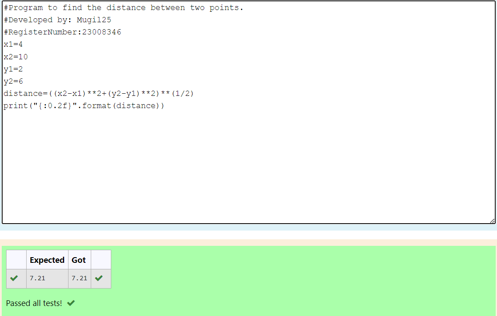

# DISTANCE-BETWEEN-TWO-POINTS

## AIM:
To write a python program to find the distance two 2 points
## ALGORITHM:
### Step 1: 
Import the math module.
### Step 2: 
Assign the value of the variable.
### Step 3: 
Substitute the values in the distance formula  
### Step 4: 
Print the distance
### Step 5: 
End the program
### PROGRAM:
```python
#Program to find the distance between two points.
#Developed by: Mugil25
#RegisterNumber:23008346
x1=4
x2=10
y1=2
y2=6
distance=((x2-x1)**2+(y2-y1)**2)**(1/2)
print("{:0.2f}".format(distance))
```
  


### OUTPUT:



### RESULT:
Distance between two points is executed successfully.
